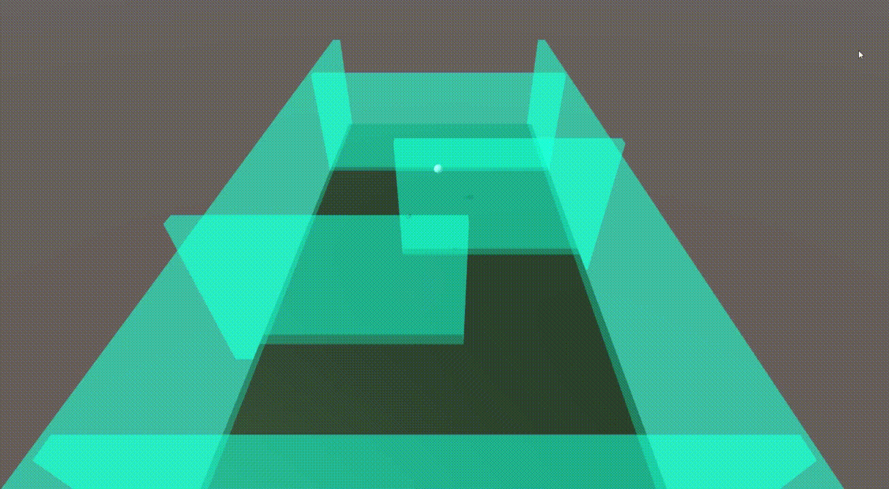

# 🐢🎾CHOPMOZZI's Profile
>안녕하세요! 테니스를 좋아하는 찹모찌입니다.
> 
>만드는 사람과 쓰는 사람 모두가 재밌는 앱을 만드는 것이 목표인 iOS 개발자입니다.
> 

### 📖Education
🌱 I’m currently learning ...  
**Kwangwoon University** - *Computer & Information Engineering*  
2018~  
Hwang Jiung(황지웅)

**부스트캠프 웹・모바일 8기** 2023.07.10 ~ 2023.08.04(챌린지), 2023.08.28 ~ (멤버십)

### 🔑Tech Stacks
#### Languages
   
#### Programming
  

### CHOPMOZZI's Work:
&nbsp; **School Project**
- System Programming: Custom Proxy Server
    - Language: C, OS: Ubuntu, Build Tool: Makefile
    - HTTP Request에 따라 Response Message를 저장하고 이를 Cache로 사용하는 Proxy Server를 구현.
    - [깃허브 레포지토리 링크](https://github.com/chopmozzi/Custom_Proxy_Server)
- Probability and Statistics: Huffman Coding
    - Language: C++, OS: Windows, Build Tool: Visual Studio Community solution
    - Huffman coding을 이용해 txt파일의 내용을 압축(Encoding), 압축한 파일을 다시 해제(Decoding)하는 과정을 구현.
    - [깃허브 레포지토리 링크](https://github.com/chopmozzi/Huffman_Coidng_in_CPP)
- Artifical Intelligence: Hexapawn
    - Language: C++, OS: Windows, Build Tool: Visual Studio Community solution 
    - Player의 선택과 Alpha-Beta Pruning을 바탕으로 한 Computer의 선택을 기반으로 하는 Hexapawn 게임 구현.
    - [깃허브 레포지토리 링크](https://github.com/chopmozzi/Hexapawn_in_CPP)

- OpenSource Software Architecture and Training: OpenSource Contribution
    - 오픈소스소프트웨어 설계 및 실습에서 팀 프로젝트로 오픈소스 컨트리뷰션 프로젝트를 진행함.
    - Webpack 문서 번역 기여.
    - [Webpack 기여 목록](https://github.com/line/webpack.kr/pulls?q=is%3Apr+is%3Aclosed+author%3Achopmozzi+)

- LigNex1 Internship Project: Autunomous Drone Simulator Based on Reinforcement
    - Language: C#, Framework: Unity, Build Tool: Visual Studio & Unity
    - LigNex1과 산학협력 프로젝트로 진행.
    - 기간: 2022.08 ~ 2023.02
    - 무인기(드론)의 자율운항 학습은 Unity환경에서 진행하며 Unity ML-Agents를 사용해 강화학습을 진행함.
    - 무인기 강화학습 예시(정적 장애물, 동적 장애물)
    - 정적 장애물
     
    
      
    - 동적 장애물
     
    
     

    - 학습 모델을 Unity ML-Agents를 이용해 적용하며 UI와 함께 결과를 테스트함으로써 시뮬레이터의 역할을 함.
    - python과 Unity사이를 통신시키는 Unity ML-Agents를 이용하여 Unity 파트 및 시뮬레이터 UI 파트를 담당함.
    - 광운대학교 제 7회 SW산학연계 전시회 우수상 수상.
    - [한국통신학회 논문](https://www.dbpia.co.kr/Journal/articleDetail?nodeId=NODE11227812)
    - [깃허브 레포지토리 링크(유료 에셋 저작권 문제로 Private전환)](https://github.com/GoDroneTeam/SW_Project-Drone-Reinforcement-Learning-Simulator)
    - [프로젝트 설명 링크](/pdf/1.pdf)
    - [프로젝트 동영상 링크](https://www.youtube.com/watch?v=-T5ADdbCwck)

 

&nbsp; **Side Project**
- App-In-App-le: NostalgiAlbum
    - Language: Swift, OS: iOS, Build Tool: Xcode
    - App-In-App-le 팀에서 진행한 프로젝트.
    - 2022.08 ~ 2023.05
    - 추억의 앨범을 테마로 자신이 원하는 앨범, 사진을 내용과 함께 꾸미는 앱을 목표로 함.
    - 앱 개발 초기에는 전반적인 부분을 팀원과 공유하며 같이 진행했고, 개발 중후반 부터는 앨범 공유, 앨범 내 사진 및 페이지 검색에 중점을 두고 진행함.
    - [깃허브 레포지토리 링크](https://github.com/App-in-App-le/NostalgiAlbum)
    - [앱 스토어 링크](https://apps.apple.com/kr/app/nostalgialbum/id6448299485)
    - [App-In-App-le NostalgiAlbum 개발 링크](https://wax-tapir-01c.notion.site/Development-a0c8ab3710084128b306dd004f5db091?pvs=4)
    - [App-In-App-le NostalgiAlbum 개발 일지 링크](https://abalone-fahrenheit-80e.notion.site/Discussion-1078a4efaabb4162b7febf7e1c90a1ba?pvs=4)
